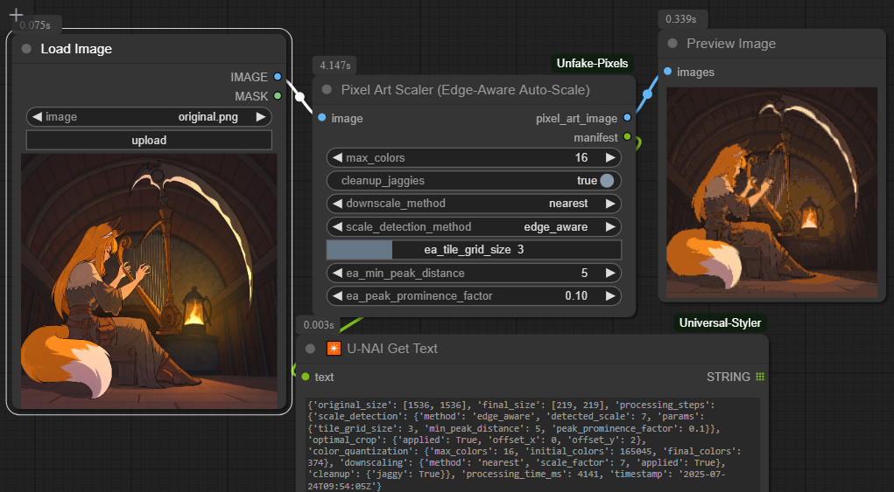

# Source
This repo is an lazy adaptation of the magnificent JS library [Unfake](https://github.com/jenissimo/unfake.js) as ComfyUI node.

Original algorythm is described at paper ["How to tame pixel art"](https://habr.com/ru/articles/930462/) (rus) of [Jenissimo](https://habr.com/ru/users/jenissimo/).

# Installing
Execute:
```bash
cd <you comfy dir>/custom_nodes/
git clone https://github.com/tauraloke/ComfyUI-Unfake-Pixels/edit/main/README.md
```
Re-run ComfyUI server.

Update your ComfyUI page in the browser.

# Usage
Find node "Pixel Art Scaler (Edge-Aware Auto-Scale)" and setup its input and output as you wish.


# Examples


